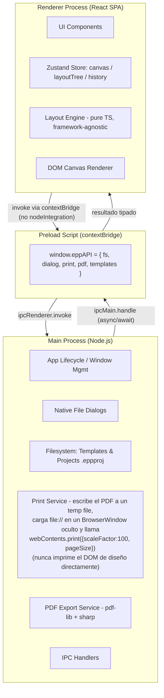
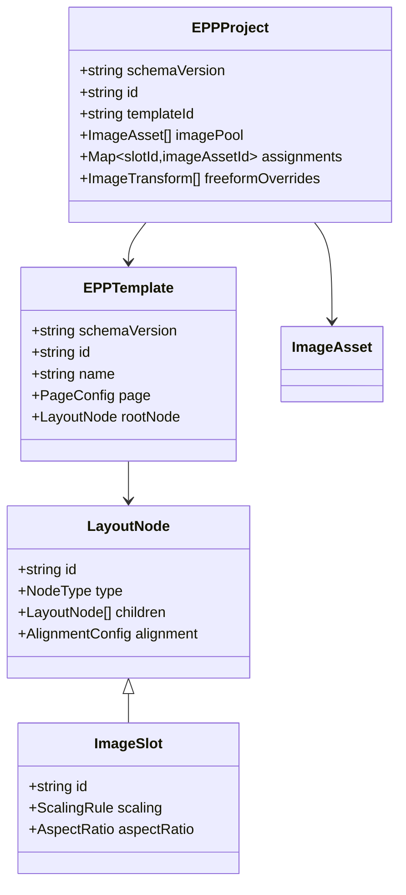
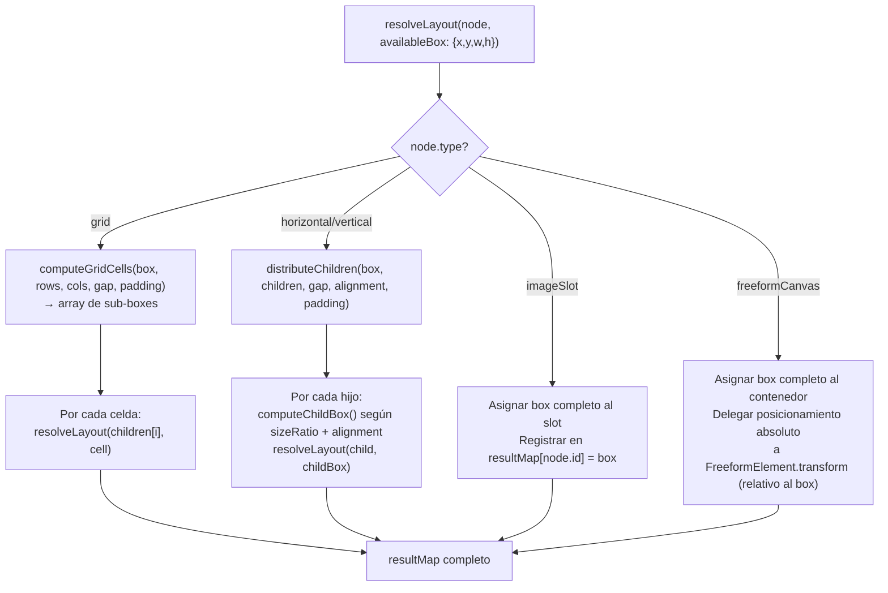
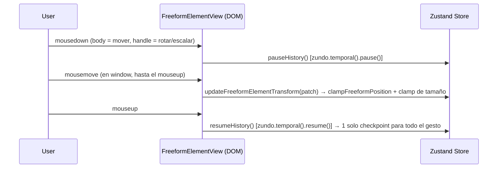
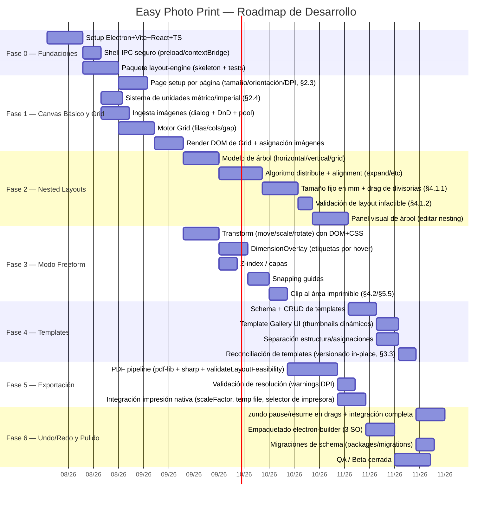
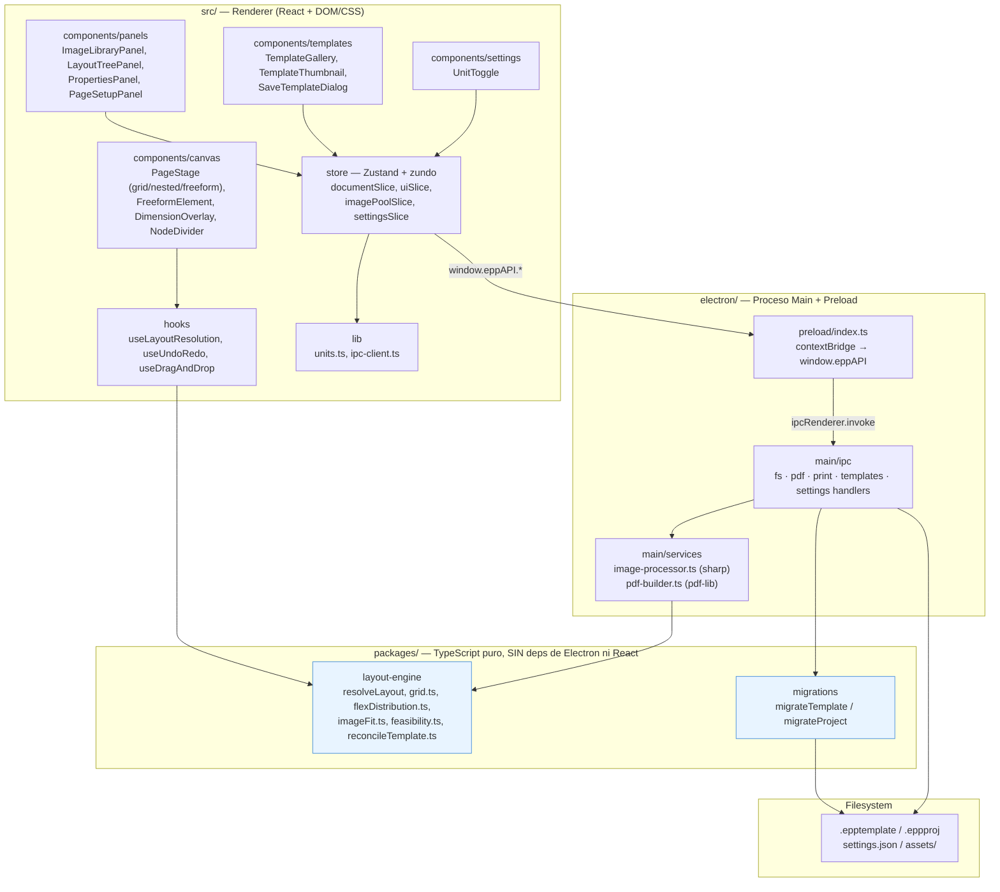

# OpenSpec Proposal: Easy Photo Print

| Campo | Valor |
|---|---|
| **Spec ID** | `EPP-2026-001` |
| **Estado** | Draft / Proposed |
| **Autor** | Software Architecture Team |
| **Fecha** | 2026-08-02 |
| **Versión** | 0.9.0 |

---

## 0. Resumen Ejecutivo

**Easy Photo Print (EPP)** es una aplicación de escritorio multiplataforma (Windows, macOS, Linux) para maquetar e imprimir fotografías domésticas con precisión profesional. Combina tres paradigmas de layout —grilla, árbol jerárquico anidado y lienzo libre— sobre un sistema de plantillas reutilizables serializadas en JSON, y exporta a PDF de alta resolución (300 DPI) listo para impresión física exacta.

---

## 1. Context & Goals

### 1.1 Justificación (Problem Statement)

La impresión doméstica de fotografías enfrenta tres fricciones recurrentes que las herramientas actuales (editores genéricos tipo Word/Canva, o software de laboratorios fotográficos cerrado) no resuelven bien simultáneamente:

1. **Precisión física ausente**: la mayoría de editores trabajan en píxeles de pantalla sin garantizar que lo impreso coincida en milímetros exactos con el diseño (errores de escalado, DPI inconsistente).
2. **Rigidez de layout**: o el usuario tiene una grilla fija sin control fino, o tiene un lienzo 100% libre sin ninguna estructura que agilice composiciones repetitivas (álbumes, collages de eventos).
3. **No reutilización**: cada composición se rehace desde cero; no existe separación entre "estructura de diseño" (template) y "contenido" (fotos), lo que impide aplicar un mismo layout a distintos sets de fotos.

### 1.2 Objetivos Principales

- **O1 — Fidelidad de impresión**: todo lo que se ve en el canvas debe imprimirse en las dimensiones físicas exactas configuradas, con un motor de exportación PDF a 300 DPI verificable matemáticamente.
- **O2 — Flexibilidad de composición**: soportar desde el caso simple (grilla 2x2 de 10x15) hasta composiciones editoriales complejas (árboles anidados de contenedores con alineación tipo Flexbox) y posicionamiento libre con transformaciones interactivas.
- **O3 — Reutilización vía templates**: permitir guardar la *estructura* de un diseño independientemente de las imágenes asignadas, de forma que un usuario pueda crear una plantilla "Álbum de cumpleaños" una vez y reutilizarla con fotos distintas cada año.
- **O4 — Experiencia nativa de escritorio**: integración con diálogos nativos de archivos, drag-and-drop del sistema operativo, e impresión nativa vía Electron, evitando limitaciones de una app web pura (CORS, sandboxing de archivos, impresión vía navegador).

### 1.3 Caso de Uso Principal (User Journey)

> María quiere imprimir una hoja A4 con 6 fotos de las vacaciones familiares en una grilla 2x3, y luego una hoja libre tipo "collage" con 4 fotos superpuestas y rotadas para enmarcar.
>
> 1. Abre EPP → selecciona tamaño de hoja A4, orientación vertical, márgenes de 5mm (internamente, el `paddingMm` del nodo raíz de la página).
> 2. Arrastra 10 fotos desde su explorador de archivos al panel de biblioteca.
> 3. Selecciona el modo **Simple**, cambia el tipo del nodo raíz a `grid`, y configura 2 columnas x 3 filas con gap de 3mm.
> 4. Arrastra 6 fotos desde la biblioteca a las celdas de la grilla; por defecto cada una se ajusta con `fitInParent` (sin recortar, respetando su aspect ratio) — María cambia una de ellas a `envelopeParent` para que llene la celda por completo recortando el sobrante.
> 5. Guarda esta estructura como template `"Grid 2x3 Vacaciones"` (sin las imágenes, solo la estructura).
> 6. Crea una segunda página, en modo **Simple** cambia el tipo del nodo raíz a `freeformCanvas`, arrastra 4 fotos libremente, las rota y escala usando los gizmos interactivos.
> 7. Exporta el documento completo a PDF a 300 DPI y lo envía a la impresora nativa del sistema.

### 1.4 No-Goals (Fuera de Alcance v1)

- Edición avanzada de imagen (filtros, corrección de color, retoque) — se asume que las fotos ya vienen editadas.
- Sincronización en la nube / colaboración multiusuario.
- Impresión directa a servicios de laboratorio fotográfico de terceros (solo impresión local / PDF).
- Versión web/SaaS (el proyecto es Electron-first, desktop-only en v1).

---

## 2. Technical Architecture

### 2.1 Stack Técnico

| Capa | Tecnología | Justificación |
|---|---|---|
| Shell de escritorio | **Electron** | Acceso a filesystem nativo, diálogos de impresión, DnD del SO |
| UI Framework | **React 18 + TypeScript** | Tipado fuerte para el schema de layout; ecosistema maduro |
| Estilos | **Tailwind CSS + Radix UI / shadcn-ui** | Velocidad de desarrollo, componentes accesibles sin bloatware |
| Estado global | **Zustand** (+ `zundo` para undo/redo) | Menor boilerplate que Redux; middleware de historial listo |
| Motor de Canvas | **DOM + CSS** (`<div>` con `position: absolute` y `transform: translate()/rotate()/scale()`) | Ya es el enfoque que usan Simple y Nested (`PageStage.tsx`); Freeform lo reutiliza en vez de introducir un segundo paradigma de render — ver nota de diseño abajo |
| Generación de PDF | **pdf-lib** (renderer principal) + `sharp` (main process, procesamiento de imagen) | Control de bajo nivel en puntos PDF (pt), soporte de embebido de imágenes a resolución completa sin pasar por el DOM |
| Build/Bundling | **Vite + electron-vite** | HMR rápido para el renderer, config unificada main/preload/renderer |
| Empaquetado | **electron-builder** | Instaladores multiplataforma (NSIS, dmg, AppImage/deb) |

> **Nota de diseño**: se descarta `@react-pdf/renderer` como motor principal porque su modelo de layout (Yoga/Flexbox) compite con nuestro propio motor de layout ya definido en el dominio; usarlo forzaría a re-expresar el árbol de nodos dos veces. `pdf-lib` permite un mapeo 1:1 directo entre nuestras coordenadas de dominio (mm) y las coordenadas PDF (pt), que es el enfoque descrito en la Sección 5.

> **Nota de diseño — Se descarta Konva.js/react-konva, incluido para Freeform.** Versiones anteriores de este documento elegían Konva (con `Konva.Transformer` para los gizmos de mover/rotar/escalar) como motor de canvas general. En la implementación real, Simple y Nested nunca necesitaron un motor de canvas dedicado — `PageStage.tsx` resuelve todo con `<div>`s posicionados vía `resolveLayout()` + `mmToPx()`, sin `<canvas>` de por medio — y ese mismo enfoque alcanza para Freeform: mover es `left`/`top` (o `transform: translate()`), rotar y escalar son `transform: rotate()/scale()`, y el hit-testing de click/drag es el de siempre en el DOM. Sumar Konva únicamente para Freeform mezclaría dos paradigmas de render en la misma app y una dependencia nueva sin necesidad real (el volumen de elementos por página es de decenas, no miles, donde un motor de canvas dedicado empieza a justificarse). Todas las menciones a `Konva`/`Konva.Transformer`/`Konva.Group` en versiones previas de este documento (§4.2, §6.1) quedan reemplazadas por su equivalente en DOM + CSS.

### 2.2 Arquitectura de Procesos de Electron



**Reglas de seguridad no negociables:**

- `contextIsolation: true`, `nodeIntegration: false`, `sandbox: true` en `BrowserWindow`.
- Todo acceso a filesystem, diálogos e impresión pasa exclusivamente por `ipcMain.handle` con canales explícitamente listados (nunca `ipcRenderer.send` genérico con eval de comandos).
- El **Layout Engine** (cálculo del árbol de nodos) vive como paquete TypeScript puro sin dependencias de Electron ni de React, para ser testeable de forma aislada y reutilizable en el proceso Main durante la exportación a PDF (ver §5).

**Decisión de diseño — Imprimir siempre pasa por el PDF:** no existen dos caminos de impresión. El botón "Imprimir" y el botón "Exportar PDF" comparten el **mismo pipeline** (§5.2): ambos generan primero el `Uint8Array` del PDF vía `pdf-lib`. La diferencia es el paso final —"Exportar" lo guarda a disco vía `dialog.showSaveDialog`, mientras que "Imprimir" escribe ese mismo buffer a un archivo temporal (`app.getPath('temp')`) y lo carga en un `BrowserWindow` oculto vía `loadURL('file://...')` (evita duplicar el buffer en base64 y los límites de longitud de `data:` URL), ejecutando `webContents.print()` (o `print({ silent: true, deviceName })` para impresión silenciosa) sobre ese visor; el archivo temporal se borra al terminar. Esto garantiza que lo impreso sea *siempre* bit-a-bit lo mismo que el PDF exportado, eliminando cualquier posibilidad de divergencia entre "lo que ves" y "lo que se imprime".

> **Riesgo — el diálogo de impresión del SO puede reescalar el PDF, rompiendo O1:** si el driver de impresión aplica "Ajustar a página imprimible" en vez de "Tamaño real", el resultado físico ya no coincide con lo diseñado, silenciosamente. Mitigación en dos capas:
> 1. Las opciones pasadas a `webContents.print()` siempre incluyen `scaleFactor: 100` y `pageSize` (en micrones, calculado a partir del mismo `pageConfig` que generó el PDF — §2.3) — nunca se deja en el default del driver.
> 2. Antes de imprimir se muestra una confirmación con el tamaño físico esperado, formateado con `formatLength` según la preferencia de unidades activa (§2.4) — p. ej. "Esta hoja mide 210×297mm" en métrico u "8.27×11.69\"" en imperial — "verificá que tu impresora esté en 'Tamaño real'", como red de seguridad porque algunos drivers ignoran `scaleFactor`. Este comportamiento se verifica empíricamente en Windows/macOS/Linux durante el hito "Integración impresión nativa" (Fase 5, §6.2); si `webContents.print()` resulta poco confiable en algún SO, la alternativa de v2 es imprimir el PDF directo vía spooler nativo (`pdf-to-printer` en Windows, `lp -o scaling=100` en macOS/Linux CUPS), evitando el visor de Chromium.
>
> **Selección de impresora para modo silencioso:** se enumeran los dispositivos disponibles con `webContents.getPrintersAsync()` y se persiste una impresora default en las preferencias de la app (`Settings.defaultPrinterName`); sin una impresora configurada, "Imprimir silencioso" cae automáticamente al diálogo interactivo.

### 2.3 Estado Global (Renderer)

Se usa **Zustand** con slices separados y el middleware `zundo` (temporal store) para undo/redo granular:

```ts
// store/index.ts
interface EPPStore {
  // --- Documento ---
  document: {
    pages: Page[];   // cada Page trae su propio pageConfig — ver Decisión de diseño abajo
  };

  // --- Selección / UI transitoria (no versionada en undo/redo) ---
  ui: {
    activePageId: string;
    selectedElementIds: string[];
    activeTool: 'select' | 'pan' | 'crop';
    layoutMode: 'simple' | 'nested';
  };

  // --- Biblioteca de imágenes cargadas (pool) ---
  imagePool: ImageAsset[];

  // --- Actions ---
  loadImages: (files: File[]) => Promise<void>;
  updateLayoutNode: (pageId: string, nodeId: string, patch: Partial<LayoutNode>) => void;
  assignImageToSlot: (pageId: string, nodeId: string, imageAssetId: string) => void;
  resizeSiblingsByDrag: (pageId: string, parentNodeId: string, siblingIndexA: number, deltaMm: number) => void;
  applyTemplate: (pageId: string, template: EPPTemplate) => void;
  exportTemplate: (pageId: string) => EPPTemplate;
  exportPdf: () => Promise<Uint8Array>;
  pauseHistory: () => void;   // wrapper de store.temporal.getState().pause() — ver §4.1.1/§4.2
  resumeHistory: () => void;  // wrapper de store.temporal.getState().resume()
}
```

> **Decisión de diseño — `pageConfig` (tamaño, orientación, DPI) es por página, no global.** Antes `pageSize`/`orientation`/`dpi` vivían en `document` como un único valor para todo el proyecto — pero eso no permite mezclar, por ejemplo, una hoja A4 con una 4x6 en el mismo `.eppproj` (algo perfectamente normal: portada + fotos sueltas). Cada `Page` ahora trae su propio `pageConfig` (mismo shape que `EPPTemplate.page`, ver §3.3), y `applyTemplate(pageId, template)` solo modifica el `pageConfig` de la página indicada, nunca del documento completo. Una página nueva copia el `pageConfig` de la página activa como punto de partida, pero queda desde ese momento completamente independiente.

> **Decisión de diseño — El modo `Simple` reemplaza al modo `Grid` como entrada por defecto y es un subconjunto restringido del editor nested.** El selector de modos de la UI es `simple | nested` — **no existe un modo `Freeform` como entrada de nivel superior**: `freeformCanvas` es únicamente un tipo de nodo más, seleccionable como tipo del nodo raíz en `Simple` (igual que `grid`/`horizontal`/`vertical`/`imageSlot`) o anidado en cualquier profundidad dentro de un `horizontal`/`vertical`/`grid` en modo `nested` (§4.1, decisión de diseño "`freeformCanvas` es un tipo de nodo más"). `Simple` admite **solo dos niveles**: el nodo raíz de la página y, si el nodo raíz es un contenedor (`grid`, `horizontal` o `vertical`), únicamente `imageSlot`s como hijos directos — nunca contenedores anidados. El panel `LayoutTree` no se muestra en `Simple`, y el usuario cambia el tipo del nodo raíz (incluyendo a `freeformCanvas`) desde el inspector contextual. El tipo inicial de una página nueva es `imageSlot`, para cubrir el caso más simple de “una sola foto que ocupa toda la hoja respetando márgenes”; si el usuario cambia el tipo raíz a `grid`/`horizontal`/`vertical`, se crean o reutilizan `imageSlot`s directos sin introducir más profundidad en el árbol; si lo cambia a `freeformCanvas`, la página entera pasa a ser un lienzo libre (el caso "collage" del user journey, §1.3). Como en `Simple` no hay `LayoutTree` para agregar o quitar hijos uno por uno, un nodo raíz `grid` controla su cantidad de `imageSlot`s con `rows`×`columns` (ya existente, §4.1) y un nodo raíz `horizontal`/`vertical` expone en el `PropertiesPanel` un campo numérico "Slots" equivalente: cambia la cantidad de `imageSlot`s hijos reconciliando con la misma lógica que usa `grid` al cambiar `rows`/`columns` (`reconcileGridChildren`) — preserva los `imageSlot`s existentes (y sus asignaciones) hasta el nuevo total, agrega vacíos si crece o trunca desde el final si decrece. El mismo campo aplica también en modo `nested` para cualquier `horizontal`/`vertical` seleccionado, como atajo al `+ Node`/`Remove` del `LayoutTree`.
>
> Por la misma razón (sin `LayoutTree`, no hay forma de volver a seleccionar el nodo raíz haciendo clic en un ítem de árbol), en `Simple` la selección **nunca queda vacía**: `ui.selectedElementIds` cae de vuelta al nodo raíz de la página activa en vez de a `[]` cada vez que se deselecciona (clic sobre el slot ya seleccionado, tecla Escape, borrar la imagen del slot seleccionado, o cambiar de página) — así el inspector contextual (`PropertiesPanel`) y su selector de tipo de nodo raíz nunca quedan inalcanzables. En modo `nested` esta regla no aplica: deseleccionar cae a `[]` como antes, porque el `LayoutTree` sigue disponible para volver a seleccionar cualquier nodo, incluida la raíz.

> **Decisión de diseño — Reemplazo vs. Swap al asignar imagen a un slot ocupado:** `assignImageToSlot` resuelve así:
> - Si `imageAssetId` **no** está asignado a ningún otro slot de la página (viene "libre" del pool, o ya está usado en **otra** página) → **reemplaza** directamente la imagen del slot destino; la imagen reemplazada vuelve a quedar disponible (desasignada) en el `imagePool`. Las imágenes no son exclusivas: la misma foto puede estar asignada a varios slots a la vez, incluso en páginas distintas.
> - Si `imageAssetId` **ya** está asignado a otro slot de esa **misma página** (arrastre entre dos slots visibles en el mismo canvas) → se hace **swap**: ambos slots intercambian sus imágenes asignadas. Esto evita que el usuario pierda accidentalmente una composición ya armada al reordenar fotos arrastrando de un slot a otro. El swap nunca cruza páginas — arrastrar desde el `ImageLibraryPanel` (que muestra el pool global) siempre es un assign simple, sea cual sea el estado previo de esa imagen.

- **Historial (Undo/Redo)**: `zundo` envuelve únicamente el slice `document` (estructura + asignaciones), excluyendo `ui` e `imagePool` bruto (los blobs de imagen no se versionan; solo referencias/IDs).
- **Persistencia de proyecto** (`.eppproj`): serialización completa de `document` + referencias a imágenes (rutas absolutas o copiadas a carpeta de assets del proyecto), delegada al Main process vía IPC.

### 2.4 Sistema de Unidades (Métrico / Imperial)

> **Requisito funcional — Alternar entre sistema métrico e imperial.** La app debe permitir al usuario cambiar la unidad de visualización/entrada de todas las medidas de longitud (tamaño de página, márgenes, gap, `fixedSizeMm`, posición/tamaño en Freeform, cotas del `DimensionOverlay`) entre **milímetros/centímetros** y **pulgadas**.

> **Decisión de diseño — El milímetro sigue siendo la única unidad canónica; el toggle es puramente de presentación.** Ni el schema (`.epptemplate`/`.eppproj`, §3.2/§3.3) ni el `layout-engine` (§4) cambian en absoluto: todos los campos siguen llamándose `*Mm` y almacenando milímetros, y todo el motor de layout sigue operando exclusivamente en mm. El sistema de unidades **no** viaja dentro del archivo — es una preferencia de la aplicación, no del documento. Esto evita el problema clásico de herramientas como Illustrator, donde dos personas abriendo el mismo archivo ven "unidades de regla" distintas guardadas en el archivo y se confunden; acá el archivo es siempre mm puro, y cada usuario elige cómo *ve* esos mm en su propia instancia de la app.

**Dónde vive la preferencia:** un nuevo slice `settings` en el store, separado de `document`/`ui`/`imagePool`, **no** envuelto por `zundo` (no es parte del historial de undo/redo del documento) y persistido fuera del proyecto, en las preferencias globales de la app:

```ts
interface AppSettings {
  unitSystem: 'metric' | 'imperial';   // default 'metric'
  defaultPrinterName?: string;          // ver §2.2
}

// EPPStore (§2.3) gana:
interface EPPStore {
  // ...document, ui, imagePool sin cambios...
  settings: AppSettings;
  setUnitSystem: (unit: 'metric' | 'imperial') => void;
}
```

`AppSettings` se persiste vía `electron-store` (o un JSON simple en `app.getPath('userData')/settings.json`) en el Main process, expuesto por IPC (`window.eppAPI.settings.get()/set()`) y cargado una sola vez al arrancar la app — sobrevive entre sesiones y aplica a todos los proyectos, no se resetea al abrir un `.eppproj` distinto.

**Conversión y formateo — capa compartida, un solo lugar:** se extiende `lib/units.ts` (ya tiene `mmToPx`/`pxToMm`/`mmToPt`, §5.1) con las funciones que usa *todo* input/label numérico de la UI, para que ningún componente reimplemente el redondeo por su cuenta:

```ts
const MM_PER_INCH = 25.4; // mismo valor ya usado en §5.1/§5.3

function mmToInches(mm: number): number {
  return mm / MM_PER_INCH;
}
function inchesToMm(inches: number): number {
  return inches * MM_PER_INCH;
}

// Formatea un valor interno en mm al string que ve el usuario, según su preferencia
function formatLength(mm: number, unitSystem: 'metric' | 'imperial'): string {
  return unitSystem === 'imperial'
    ? `${mmToInches(mm).toFixed(2)}"`   // 2 decimales, p.ej. 3.94" — sin fracciones (1/8") en v1
    : `${mm.toFixed(1)}mm`;              // 1 decimal, resolución habitual de impresión
}

// Interpreta lo que el usuario tipeó en un input, siempre devuelve mm para persistir
function parseLength(input: string, unitSystem: 'metric' | 'imperial'): number {
  const value = parseFloat(input.replace(/[^\d.-]/g, ''));
  return unitSystem === 'imperial' ? inchesToMm(value) : value;
}
```

`formatLength`/`parseLength` son los únicos puntos de conversión de toda la UI: `PropertiesPanel` (alto/ancho fijo, gap, padding), `PageSetupPanel` (tamaño de hoja custom), `DimensionOverlay` (etiquetas de dimensión por hover sobre cualquier `imageSlot`, §4.1) y el diálogo de confirmación de impresión (§2.2) los usan todos, en vez de formatear números "a mano" cada uno por su lado.

**Qué NO se ve afectado por el toggle:**
- El **DPI** (`page.dpi`, §3.2/§3.3) es un concepto de resolución de imagen (puntos por pulgada) universal en toda la industria de impresión, independiente del sistema de unidades elegido para longitudes — se muestra siempre como "DPI", nunca se convierte.
- Los **presets de tamaño de hoja** (`sizePreset: 'A4' | 'Letter' | ...`) no cambian de valor ni de nombre con el toggle — solo su *label* mostrado en el selector incluye la equivalencia en la unidad activa (p. ej. `A4 (210 × 297 mm)` en métrico, `A4 (8.27 × 11.69")` en imperial), a partir del mismo `formatLength`.
- La tolerancia de snapping dentro de un nodo `freeformCanvas` (§4.2, "~3px en pantalla") es espacio-pantalla, no una medida de diseño — no depende del sistema de unidades.

**UI:** un componente `UnitToggle.tsx` (switch "mm / in") visible en la barra de herramientas global, que llama a `setUnitSystem`. El cambio es instantáneo y solo re-renderiza labels/inputs — no dispara ningún recálculo del `layout-engine` (los mm internos no cambiaron).

---

## 3. Data Schema (JSON Specifications)

### 3.1 Principio de Diseño: Separación Estructura / Contenido

Todo template (`.epptemplate`) define **exclusivamente la estructura**: tamaño de hoja, árbol de layout, y *slots* de imagen vacíos con sus reglas de escalado/recorte. Un **proyecto** (`.eppproj`) referencia un template (opcional) y añade las asignaciones concretas `slotId → imageAssetId`.

> **Decisión de diseño — Alcance de un template: una sola página.** Un `.epptemplate` describe **una única estructura de página** (`rootNode`), no un álbum completo. Un "álbum" (portada + interiores) se arma en el proyecto aplicando el mismo template repetidas veces a distintas páginas, o combinando varios templates distintos en las distintas páginas de un mismo `.eppproj`. Esto mantiene el schema simple (un `rootNode` por template) y hace que los templates sean piezas reutilizables de grano fino en vez de documentos completos.



### 3.2 JSON Schema — `EPPTemplate` (`.epptemplate`)

```jsonc
{
  "$schema": "https://json-schema.org/draft/2020-12/schema",
  "$id": "https://easyphotoprint.app/schemas/template.v1.json",
  "title": "EPPTemplate",
  "type": "object",
  "required": ["schemaVersion", "id", "name", "page", "rootNode"],
  "properties": {
    "schemaVersion": { "type": "string", "enum": ["1.0.0"], "description": "Versión del schema. Ver 'Decisión de diseño — Migración de schema' abajo: no es un const fijo, es la primera entrada de una cadena de migraciones soportadas." },
    "id": { "type": "string", "format": "uuid" },
    "name": { "type": "string", "minLength": 1 },
    "createdAt": { "type": "string", "format": "date-time" },
    "updatedAt": { "type": "string", "format": "date-time" },

    "page": {
      "type": "object",
      "required": ["sizePreset", "orientation", "dpi"],
      "properties": {
        "sizePreset": {
          "enum": ["A4", "Letter", "Legal", "4x6", "5x7", "A3", "Custom"]
        },
        "customSizeMm": {
          "type": "object",
          "properties": {
            "widthMm": { "type": "number", "exclusiveMinimum": 0 },
            "heightMm": { "type": "number", "exclusiveMinimum": 0 }
          }
        },
        "orientation": { "enum": ["portrait", "landscape"] },
        "dpi": { "type": "integer", "default": 300, "minimum": 72 }
      }
    },

    "rootNode": { "$ref": "#/$defs/LayoutNode" }
  },

  "$defs": {
    "LayoutNode": {
      "type": "object",
      "required": ["id", "type"],
      "properties": {
        "id": { "type": "string" },
        "type": {
          "enum": ["grid", "horizontal", "vertical", "imageSlot", "freeformCanvas"]
        },
        "sizeRatio": {
          "description": "Peso relativo del nodo dentro de su contenedor padre (flex-grow-like). Ignorado en el eje que tenga fixedSizeMm definido.",
          "type": "number",
          "default": 1
        },
        "fixedSizeMm": {
          "description": "Tamaño absoluto fijo (mm), opcional e independiente por eje. Si el eje coincide con el eje principal del contenedor padre ('horizontal'→widthMm, 'vertical'→heightMm), el nodo deja de participar en la distribución por sizeRatio en ese eje (equivalente a flex-basis fijo + flex-grow:0, ver §4.1.1). Si coincide con el eje cruzado, sobreescribe el tamaño que calcularía 'alignment' en ese eje. Sin efecto especial si el contenedor padre es 'grid' (celdas ya son de tamaño uniforme).",
          "type": "object",
          "properties": {
            "widthMm": { "type": "number", "exclusiveMinimum": 0 },
            "heightMm": { "type": "number", "exclusiveMinimum": 0 }
          }
        },
        "alignment": {
          "type": "object",
          "properties": {
            "horizontal": { "enum": ["left", "center", "right", "expand"] },
            "vertical": { "enum": ["top", "center", "bottom", "expand"] }
          }
        },
        "gapMm": { "type": "number", "minimum": 0, "default": 0 },
        "paddingMm": {
          "type": "object",
          "properties": {
            "top": { "type": "number" }, "right": { "type": "number" },
            "bottom": { "type": "number" }, "left": { "type": "number" }
          }
        },

        "gridConfig": {
          "description": "Solo aplica si type === 'grid'",
          "type": "object",
          "properties": {
            "rows": { "type": "integer", "minimum": 1 },
            "columns": { "type": "integer", "minimum": 1 },
            "autoFit": { "type": "boolean", "default": false },
            "rowGapMm": { "type": "number", "minimum": 0, "description": "Override de gapMm solo para el eje de filas; si se omite, usa gapMm" },
            "columnGapMm": { "type": "number", "minimum": 0, "description": "Override de gapMm solo para el eje de columnas; si se omite, usa gapMm" }
          }
        },

        "imageSlotConfig": {
          "description": "Solo aplica si type === 'imageSlot'. La identidad estable del slot es el propio LayoutNode.id — no hay un slotId separado (ver Decisión de diseño, §3.3).",
          "type": "object",
          "properties": {
            "aspectRatio": { "type": "number", "description": "width/height deseado; null = libre" },
            "scalingRule": {
              "enum": ["fitInParent", "envelopeParent", "stretch"],
              "default": "fitInParent",
              "description": "fitInParent: la imagen se escala completa dentro del slot sin recortar, preservando aspect ratio (puede dejar espacio vacío). envelopeParent: la imagen se escala para cubrir el slot por completo, preservando aspect ratio y recortando el sobrante. stretch: la imagen se deforma para ocupar exactamente el slot, ignorando su aspect ratio original (sin recorte y sin espacio vacío)."
            },
            "focalPoint": {
              "type": "object",
              "properties": { "x": { "type": "number" }, "y": { "type": "number" } },
              "description": "0..1 normalizado, punto de anclaje del crop en modo 'envelopeParent'. No aplica en 'fitInParent' ni en 'stretch' (ninguno de los dos recorta)."
            }
          }
        },

        "freeformElements": {
          "description": "Solo aplica si type === 'freeformCanvas'",
          "type": "array",
          "items": { "$ref": "#/$defs/FreeformElement" }
        },

        "children": {
          "type": "array",
          "items": { "$ref": "#/$defs/LayoutNode" }
        }
      }
    },

    "FreeformElement": {
      "type": "object",
      "required": ["id", "imageNodeId", "transform"],
      "properties": {
        "id": { "type": "string" },
        "imageNodeId": { "type": "string", "description": "LayoutNode.id del imageSlot que este elemento representa (antes 'slotId')." },
        "zIndex": { "type": "integer", "default": 0 },
        "transform": {
          "type": "object",
          "required": ["xMm", "yMm", "widthMm", "heightMm", "rotationDeg"],
          "properties": {
            "xMm": { "type": "number" },
            "yMm": { "type": "number" },
            "widthMm": { "type": "number", "exclusiveMinimum": 0 },
            "heightMm": { "type": "number", "exclusiveMinimum": 0 },
            "rotationDeg": { "type": "number", "minimum": -180, "maximum": 180 },
            "lockAspectRatio": { "type": "boolean", "default": true }
          }
        }
      }
    }
  }
}
```

> **Decisión de diseño — Migración de schema.** `schemaVersion` no es un valor fijo eterno: es la primera entrada de una cadena de migraciones. Cuando el schema cambie (como ya pasó varias veces durante el diseño de este documento), se agrega una nueva versión al `enum` y una función `migrateTemplate(raw: unknown): EPPTemplate` en un paquete dedicado `packages/migrations/`, con un `switch` sobre `raw.schemaVersion` que aplica transformaciones en cadena hasta la versión más reciente (p. ej. `1.0.0 → 1.1.0 → 1.2.0`). Se ejecuta automáticamente al leer cualquier `.epptemplate`/`.eppproj` del disco, antes de pasarlo al resto de la app — así el resto del código nunca necesita conocer versiones viejas del schema.

> **Decisión de diseño — Márgenes unificados con Padding:** `page` ya **no** tiene un campo `marginsMm` propio. El margen de la hoja **es** el `paddingMm` del `rootNode` (sea `grid`, `horizontal`, `vertical` o `freeformCanvas` — los cuatro tipos heredan `paddingMm` de `LayoutNode`, §3.2). Esto evita tener dos fuentes de verdad para el mismo concepto: el "área imprimible" de una página es siempre `pageBoxMm` menos el `paddingMm` del nodo raíz. Un margen de "0mm" es simplemente `paddingMm: { top: 0, right: 0, bottom: 0, left: 0 }`. Ver §4.2 para el caso particular de `freeformCanvas`, donde este padding actúa además como **límite de recorte** (clip) en pantalla y en export.

### 3.3 Modelo de Datos — Proyecto (`.eppproj`)

```ts
interface ImageAsset {
  id: string;                 // uuid
  originalPath: string;       // ruta absoluta origen
  storedPath: string;         // ruta copiada dentro de /assets del proyecto
  fileName: string;
  widthPx: number;
  heightPx: number;
  dpiOriginal?: number;       // metadata EXIF si existe
  thumbnailDataUrl: string;   // cache para el panel de biblioteca
}

interface PageConfig {
  sizePreset: 'A4' | 'Letter' | 'Legal' | '4x6' | '5x7' | 'A3' | 'Custom';
  customSizeMm?: { widthMm: number; heightMm: number };
  orientation: 'portrait' | 'landscape';
  dpi: number;                 // default 300 — mismo shape que EPPTemplate.page (§3.2)
}

interface EPPProject {
  schemaVersion: '1.0.0';
  id: string;
  name: string;
  pages: {
    id: string;
    pageConfig: PageConfig;   // por página, no global — ver Decisión de diseño en §2.3
    templateRef?: string;     // id de EPPTemplate aplicado, o null si ad-hoc
    rootNode: LayoutNode;      // copia mutable del árbol (puede divergir del template original)
    assignments: Record<string /* LayoutNode.id de un imageSlot */, string /* imageAssetId */>;
  }[];
  imagePool: ImageAsset[];
}
```

> **Decisión de diseño — Un solo identificador estable (`LayoutNode.id`), sin `slotId` separado.** El schema tenía un `imageSlotConfig.slotId` distinto del `LayoutNode.id` del propio nodo, sin relación documentada entre ambos — se elimina `slotId` por redundante. Regla única: **`LayoutNode.id` es estable mientras el nodo exista lógicamente**; solo se genera un `id` nuevo cuando el usuario crea un nodo nuevo, nunca al mover, reordenar o envolver nodos existentes (tampoco durante la reconciliación de templates, ver más abajo). `assignments` y `FreeformElement` referencian directamente ese `id` (el campo `FreeformElement.slotId` se renombra a `imageNodeId`, §3.2).

**Regla clave**: al "Aplicar" un template a una página, el `rootNode` del template se **clona** dentro de `page.rootNode`. Ediciones posteriores (agregar una fila, mover una imagen dentro de un nodo `freeformCanvas`) modifican la copia del proyecto, no el template original — a menos que el usuario ejecute explícitamente "Guardar cambios en template".

> **Decisión de diseño — Versionado tipo "símbolo compartido" (in-place, no inmutable):** "Guardar cambios en template" **sobrescribe** el `.epptemplate` original conservando su mismo `id` — no crea una copia versionada. Todo `page.rootNode` de cualquier proyecto cuyo `templateRef` apunte a ese `id` queda considerado **desincronizado** y se resuelve la próxima vez que ese proyecto se abre (o mediante una acción explícita "Actualizar desde template" en la UI, con badge de aviso en la página afectada — nunca de forma silenciosa mientras el usuario está trabajando). La reconciliación sigue estas reglas, por `LayoutNode.id`:
>
> 1. Se reemplaza la estructura del árbol (`rootNode`) de la página por la nueva versión del template (clon fresco).
> 2. Para cada `id` de `imageSlot` presente tanto en la versión vieja como en la nueva, se **preserva** la asignación `id → imageAssetId` existente.
> 3. Para `id`s que existían antes pero fueron **eliminados** en la nueva versión del template, la imagen asignada vuelve al `imagePool` (no se pierde, solo se desasigna).
> 4. Para `id`s **nuevos** introducidos por la nueva versión del template, el slot queda vacío a la espera de que el usuario asigne una imagen.
>
> Esta reconciliación vive en el `layout-engine` compartido (`reconcileTemplateUpdate(oldRootNode, newRootNode, assignments)`) para poder testearse de forma aislada.

---

## 4. Layout Engine Design

### 4.1 Algoritmo de Renderizado del Árbol Anidado (Nested Engine)

El motor de layout es un **algoritmo de layout de dos pasadas** (medir → posicionar), inspirado en Flexbox pero simplificado, operando siempre en **milímetros** (no píxeles) como unidad canónica interna.

> **Requisito funcional — Espaciado configurable (Grid y Horizontal/Vertical):** todo nodo `grid`, `horizontal` y `vertical` **debe** exponer, editable desde el `PropertiesPanel`, dos controles independientes:
> - **Gap (`gapMm`)**: espaciado entre imágenes/hijos adyacentes dentro del contenedor. En `grid` se aplica tanto entre columnas como entre filas; opcionalmente puede desglosarse en `rowGapMm`/`columnGapMm` cuando el usuario necesita espaciados distintos por eje.
> - **Padding (`paddingMm`)**: margen interno entre el borde del contenedor (celda de grid, fila/columna padre, o página) y sus hijos, definido por lado (`top`/`right`/`bottom`/`left`). Aplica de forma recursiva — un nodo `grid` anidado dentro de un `vertical` respeta tanto el padding del `vertical` como el suyo propio.
>
> Ambos valores ya están definidos en el schema (§3.2, campos `gapMm`/`paddingMm` de `LayoutNode`) y son obligatorios de implementar en el motor de resolución (no solo de persistir): el algoritmo siguiente muestra cómo se aplican.

> **Requisito funcional — Modos de llenado de `imageSlot`:** toda imagen asignada a un `imageSlot` (en `grid`, `horizontal`, `vertical` o `freeformCanvas`) debe poder llenar su slot con uno de tres modos, controlados por `scalingRule` (§3.2):
> - **`fitInParent`** *(modo por defecto)*: la imagen se escala completa dentro del slot manteniendo su aspect ratio original, sin recortar nada. Si el aspect ratio de la imagen no coincide con el del slot, queda espacio vacío (letterboxing) en los lados sobrantes — ese espacio se deja transparente, mostrando el fondo blanco de la página.
> - **`envelopeParent`**: la imagen se escala para cubrir el slot por completo manteniendo su aspect ratio, recortando el sobrante según el `focalPoint` (mismo mecanismo que el anterior `cover`/`crop-to-fill`, ver §5.4).
> - **`stretch`**: la imagen se deforma (escala X e Y de forma independiente) para ocupar exactamente el `slotBoxMm`, ignorando su aspect ratio original. No hay recorte ni espacio vacío, pero la imagen puede verse distorsionada si el aspect ratio del slot difiere mucho del original — el `PropertiesPanel` debe mostrar una advertencia no bloqueante cuando la distorsión resultante supera un umbral (p. ej. >15% de diferencia entre aspect ratios).
>
> Los tres modos se implementan como funciones puras en el `layout-engine` compartido (`computeFitInParent` / `computeEnvelopeCrop` / `computeStretch`, §5.4) para garantizar paridad WYSIWYG entre la vista previa (DOM) y la exportación (PDF).



> **Decisión de diseño — `freeformCanvas` es un tipo de nodo más, anidable en cualquier profundidad.** El árbol de layout no distingue `freeformCanvas` de `grid`/`horizontal`/`vertical`/`imageSlot` a la hora de anidar: puede aparecer como hijo directo de un `horizontal`/`vertical`/`grid`, a cualquier profundidad, exactamente igual que los demás tipos — el flowchart de `resolveLayout` de arriba ya lo trata como una rama más, asignándole el `box` que le toque como a cualquier otro nodo (§4.2 documenta qué hace ese nodo puertas adentro con ese `box`: delega el posicionamiento de sus `freeformElements` en vez de distribuir `children`). En la UI, el modo `nested` (`LayoutTreePanel`, inspector de tipo de nodo) debe permitir agregar o retipar cualquier nodo a `freeformCanvas` igual que a los otros tres tipos, y en modo `Simple` es una opción más del selector de tipo del nodo raíz (§2.3) — no existe un modo `Freeform` de nivel superior separado. La única restricción de anidado sigue siendo la de dos niveles de `Simple` (§2.3), que aplica por diseño a los cinco tipos de nodo por igual, no específicamente a `freeformCanvas`.

> **Requisito funcional — Etiquetas de dimensión por hover (reemplaza el overlay de cotas en vivo de versiones anteriores de este documento).** Todo `imageSlot`, sin importar el tipo de contenedor que lo aloje (`grid`, `horizontal`, `vertical` o `freeformCanvas`), muestra sus dimensiones físicas al pasar el mouse por encima — no hay overlay de cotas permanente ni actualizado en vivo durante un drag, es pura interacción de hover, independiente de que el nodo esté siendo arrastrado o sea un `FreeformElement`:
> - **Hover sobre el slot**: aparece un texto gris en la esquina superior derecha del slot con `formatLength(box.w) × formatLength(box.h)` (§2.4 — respeta la unidad activa), usando el `BoxMm` que le asignó `resolveLayout` a ese nodo.
> - **Hover sobre la imagen asignada dentro del slot**: la etiqueta del slot (gris, arriba a la derecha) persiste, y además aparece una segunda etiqueta en amarillo en la esquina inferior izquierda del slot con las dimensiones reales de la imagen dentro de ese slot — que no siempre coinciden con las del slot: en `fitInParent` es el tamaño resultante de `computeFitInParent` (puede ser menor por el letterboxing); en `envelopeParent` y `stretch` coincide exactamente con el tamaño del slot, porque ambos modos llenan el slot por completo. La detección de "está el mouse sobre la imagen" usa ese mismo rectángulo (`computeFitInParent` cuando aplica, el `slotBoxMm` completo en los otros dos modos) — **no** el bounding box completo del slot: en `fitInParent` con letterboxing, las franjas vacías del slot cuentan como "hover del slot" (etiqueta gris) pero no como "hover de la imagen" (etiqueta amarilla).
> - No se muestran coordenadas (`xMm`/`yMm`) ni ángulo de rotación en esta etiqueta.
>
> Esto reemplaza el ítem "Overlay de cotas" que antes describía §4.2 (`DimensionOverlay`): ese componente pasa a implementar esta interacción de hover en vez de un overlay en vivo durante drag. El resto de §4.2 (transform en mm, snapping, bloqueo de aspect ratio, recorte al área imprimible) sigue aplicando sin cambios, específicamente para `freeformCanvas`.

**Aplicación de `paddingMm`** (común a `grid`, `horizontal` y `vertical`): antes de distribuir a los hijos, todo contenedor reduce su `box` disponible restando el padding de cada lado. Esto se resuelve en una única función reutilizada por ambos algoritmos:

```ts
function applyPadding(box: BoxMm, padding?: Partial<Sides>): BoxMm {
  const p = { top: 0, right: 0, bottom: 0, left: 0, ...padding };
  return {
    x: box.x + p.left,
    y: box.y + p.top,
    w: box.w - p.left - p.right,
    h: box.h - p.top - p.bottom,
  };
}
```

**Pseudocódigo — distribución en contenedor `horizontal`/`vertical` (equivalente a flex-direction: row/column):**

```ts
function distributeChildren(
  rawBox: BoxMm,
  children: LayoutNode[],
  gapMm: number,
  direction: 'horizontal' | 'vertical',
  alignment: AlignmentConfig,
  paddingMm?: Partial<Sides>
): BoxMm[] {
  const box = applyPadding(rawBox, paddingMm); // margen interno del contenedor, aplicado 1 sola vez
  const mainAxis = direction === 'horizontal' ? 'w' : 'h';
  const mainAxisKey = direction === 'horizontal' ? 'widthMm' : 'heightMm';   // eje principal → fixedSizeMm
  const crossAxisKey = direction === 'horizontal' ? 'heightMm' : 'widthMm'; // eje cruzado   → fixedSizeMm
  const totalGap = gapMm * (children.length - 1);

  // Fase 1: los hijos con fixedSizeMm en el eje principal salen del pool flexible (flex-basis fijo + grow:0)
  const fixedTotal = children.reduce((sum, c) => sum + (c.fixedSizeMm?.[mainAxisKey] ?? 0), 0);
  const flexibleChildren = children.filter((c) => c.fixedSizeMm?.[mainAxisKey] == null);
  // clamp defensivo: si los fixedSizeMm ya suman más que el contenedor, availableMain nunca es negativo
  // (el layout queda infactible igual, pero validateLayoutFeasibility de §4.1.2 es quien lo reporta)
  const availableMain = Math.max(0, box[mainAxis] - totalGap - fixedTotal);
  const totalRatio = flexibleChildren.reduce((sum, c) => sum + (c.sizeRatio ?? 1), 0);

  let cursor = direction === 'horizontal' ? box.x : box.y;
  return children.map((child) => {
    const mainSize = child.fixedSizeMm?.[mainAxisKey]
      ?? (availableMain * (child.sizeRatio ?? 1)) / totalRatio;
    const crossSize = direction === 'horizontal' ? box.h : box.w;

    // Alineación en el eje cruzado (perpendicular a la dirección de distribución)
    const crossAlign = direction === 'horizontal' ? alignment.vertical : alignment.horizontal;
    const { crossOffset, crossFinalSize } = resolveCrossAxis(crossAlign, crossSize, mainSize, child, crossAxisKey);

    const childBox: BoxMm = direction === 'horizontal'
      ? { x: cursor, y: box.y + crossOffset, w: mainSize, h: crossFinalSize }
      : { x: box.x + crossOffset, y: cursor, w: crossFinalSize, h: mainSize };

    cursor += mainSize + gapMm;
    return childBox;
  });
}

function resolveCrossAxis(align: Alignment, crossSize: number, mainSize: number, child: LayoutNode, crossAxisKey: 'widthMm' | 'heightMm') {
  const fixedCross = child.fixedSizeMm?.[crossAxisKey]; // máxima prioridad: gana incluso sobre 'expand'
  const aspectRatio = child.type === 'imageSlot' ? child.imageSlotConfig?.aspectRatio : undefined;
  const intrinsicFromAspect = aspectRatio
    ? (crossAxisKey === 'heightMm' ? mainSize / aspectRatio : mainSize * aspectRatio)
    : undefined;
  // fallback: para contenedores anidados (grid/horizontal/vertical) sin fixedSizeMm ni aspectRatio propio,
  // el tamaño intrínseco es su propio mínimo requerido — reutiliza computeMinRequiredMainSizeMm (§4.1.1),
  // así 'center'/'top'/'bottom' hacen shrink-to-fit real también para contenedores, no solo para imageSlot
  const intrinsicFromContent = aspectRatio == null && child.type !== 'imageSlot'
    ? computeMinRequiredMainSizeMm(child, crossAxisKey === 'heightMm' ? 'h' : 'w')
    : undefined;

  const intrinsic = fixedCross ?? intrinsicFromAspect ?? intrinsicFromContent;

  if (intrinsic == null || (align === 'expand' && fixedCross == null)) {
    return { crossOffset: 0, crossFinalSize: crossSize }; // sin tamaño intrínseco definido → ocupa el cruce completo
  }

  const finalSize = Math.min(intrinsic, crossSize); // nunca excede el espacio disponible del contenedor
  const offset =
    align === 'center' ? (crossSize - finalSize) / 2 :
    (align === 'right' || align === 'bottom') ? (crossSize - finalSize) : 0; // 'left'/'top'
  return { crossOffset: offset, crossFinalSize: finalSize };
}
```

> `computeMinRequiredMainSizeMm` se define en §4.1.1 (junto con la corrección de su rama para `grid`) — se referencia acá porque `resolveCrossAxis` la reutiliza como tamaño intrínseco de fallback para contenedores anidados.

### 4.1.1 Redimensionado Interactivo de Hijos (Drag de Divisoria) y Tamaño Fijo en mm

> **Requisito funcional — Ajuste de tamaño relativo entre hermanos arrastrando el puntero:** dentro de un contenedor `horizontal` o `vertical`, el usuario debe poder arrastrar la línea divisoria entre dos nodos hijos **adyacentes** (sean `imageSlot`, `grid`, `horizontal`, `vertical` o `freeformCanvas` anidados) para ajustar su tamaño relativo entre sí. Esto se persiste como el **peso** (`sizeRatio`, ya definido en el schema, §3.2) de cada uno respecto a su contenedor padre — no como un valor absoluto en mm, para que el layout siga siendo responsive si cambia el tamaño de hoja o el árbol se reutiliza en un template. **No aplica a `grid`**: sus celdas se derivan de `rows`/`columns` (tamaño uniforme), no de `sizeRatio` por hijo — quedaría como posible extensión futura (columnas/filas de ancho variable), fuera de alcance v1.

> **Requisito funcional — Tamaño fijo en mm para una imagen (convive con el drag de divisoria):** desde el `PropertiesPanel`, al seleccionar un `imageSlot` (u otro nodo) el usuario puede fijar opcionalmente su **ancho**, su **alto**, o ambos, en milímetros (`fixedSizeMm`, §3.2). El eje que coincida con el eje principal del contenedor padre deja de repartirse por `sizeRatio` y pasa a ocupar exactamente ese valor fijo (flex-basis fijo, análogo a `flex: 0 0 <mm>` en CSS); el resto de los hijos flexibles se reparten el espacio restante entre sí, exactamente igual que antes. El eje cruzado, si se fija, sobreescribe el tamaño que hubiera calculado `alignment` (§4.1) para ese nodo.
>
> **Ejemplo (el del enunciado):** contenedor `horizontal` con 3 slots. El usuario fija el ancho del slot 1 en `100mm`. Consecuencia:
> - La divisoria entre el slot 1 y el slot 2 queda **bloqueada** (no arrastrable) — mover esa línea implicaría cambiar el ancho del slot 1, que el usuario fijó explícitamente.
> - La divisoria entre el slot 2 y el slot 3 sigue siendo arrastrable con normalidad — redistribuye `sizeRatio` solo entre esos dos, sin afectar al slot 1 ni al ancho total del contenedor.
> - El slot 1 deja de sumar a `totalRatio`; su `100mm` se descuenta del `availableMain` antes de repartir el resto por `sizeRatio` entre los slots 2 y 3.
>
> **Regla derivada — mínimo fijo propagado al padre:** al fijar el ancho de un hijo en mm, ese contenedor `horizontal` ya no puede angostarse (por ejemplo, si él mismo es hijo de OTRO contenedor y su propio divisor se arrastra) por debajo de la suma de los tamaños fijos de sus hijos más el espacio mínimo de los flexibles. Es decir, el `fixedSizeMm` de un nieto establece un **piso de tamaño mínimo heredado** para su padre inmediato (y transitivamente hacia arriba en el árbol). Esto se calcula con `computeMinRequiredMainSizeMm` más abajo y reemplaza el piso plano que usaba antes `resizeSiblingsByDrag`.

**Regla de bloqueo de divisorias:** una divisoria entre el hijo `i` y el hijo `i+1` es arrastrable **solo si ninguno de los dos** tiene `fixedSizeMm` definido en el eje principal del contenedor. Si cualquiera de los dos lo tiene, la divisoria queda fija en su posición:

```ts
function isDividerLocked(children: LayoutNode[], i: number, mainAxisKey: 'widthMm' | 'heightMm'): boolean {
  return children[i].fixedSizeMm?.[mainAxisKey] != null || children[i + 1].fixedSizeMm?.[mainAxisKey] != null;
}
```

**Mínimo requerido bottom-up:** reemplaza el piso plano anterior por uno derivado de los `fixedSizeMm` de los descendientes (si no hay ninguno, se comporta igual que antes, con el piso plano `MIN_SIZE_RATIO_MM` como caso base):

```ts
const MIN_SIZE_RATIO_MM = 10; // piso de tamaño en mm cuando no hay fixedSizeMm involucrado

function computeMinRequiredMainSizeMm(node: LayoutNode, axis: 'w' | 'h'): number {
  const axisKey = axis === 'w' ? 'widthMm' : 'heightMm';
  if (node.type === 'imageSlot' || node.type === 'freeformCanvas') {
    return node.fixedSizeMm?.[axisKey] ?? MIN_SIZE_RATIO_MM;
  }

  const padding = node.paddingMm ?? {};
  const paddingAlongAxis = axis === 'w' ? (padding.left ?? 0) + (padding.right ?? 0) : (padding.top ?? 0) + (padding.bottom ?? 0);
  const children = node.children ?? [];

  if (node.type === 'grid') {
    // a diferencia de horizontal/vertical, grid necesita un mínimo real en AMBOS ejes:
    // ancho mínimo = suma de mínimos por columna; alto mínimo = suma de mínimos por fila (nunca el máximo)
    const { rows, columns } = resolveDimensions(node.gridConfig, children.length);
    const perColumnMin = Array(columns).fill(0);
    const perRowMin = Array(rows).fill(0);
    children.forEach((child, i) => {
      const col = i % columns;
      const row = Math.floor(i / columns);
      perColumnMin[col] = Math.max(perColumnMin[col], computeMinRequiredMainSizeMm(child, 'w'));
      perRowMin[row] = Math.max(perRowMin[row], computeMinRequiredMainSizeMm(child, 'h'));
    });
    const colGap = node.gridConfig?.columnGapMm ?? node.gapMm ?? 0;
    const rowGap = node.gridConfig?.rowGapMm ?? node.gapMm ?? 0;
    return axis === 'w'
      ? perColumnMin.reduce((sum, v) => sum + v, 0) + colGap * Math.max(columns - 1, 0) + paddingAlongAxis
      : perRowMin.reduce((sum, v) => sum + v, 0) + rowGap * Math.max(rows - 1, 0) + paddingAlongAxis;
  }

  const nodeMainAxisKey = node.type === 'horizontal' ? 'w' : node.type === 'vertical' ? 'h' : null;
  if (nodeMainAxisKey === axis) {
    // eje principal del propio nodo: los mínimos de los hijos se SUMAN (van uno al lado del otro)
    const gapTotal = (node.gapMm ?? 0) * Math.max(children.length - 1, 0);
    return children.reduce((sum, c) => sum + computeMinRequiredMainSizeMm(c, axis), gapTotal) + paddingAlongAxis;
  }
  // eje cruzado de horizontal/vertical: los hijos están en paralelo, se toma el máximo, no la suma
  return Math.max(MIN_SIZE_RATIO_MM, ...children.map((c) => computeMinRequiredMainSizeMm(c, axis))) + paddingAlongAxis;
}
```

**Algoritmo — `resizeSiblingsByDrag`:** el gesto de arrastre solo redistribuye peso entre los **dos** hijos adyacentes a la divisoria movida (y solo si esa divisoria no está bloqueada); el resto de los hermanos no debe verse afectado. Se convierte el `deltaMm` arrastrado a una `deltaRatio` usando la constante de proporción del contenedor (`totalRatio / availableMain`, calculados igual que en `distributeChildren` — es decir, ya excluyendo a los hermanos con `fixedSizeMm`), y se transfiere esa cantidad de un hijo al otro conservando la suma `ratioA + ratioB` — así el resto de los hermanos, cuyo `sizeRatio` no cambia, terminan ocupando exactamente el mismo espacio en mm que antes del arrastre. El piso mínimo por lado ya no es el valor plano, sino el que devuelve `computeMinRequiredMainSizeMm`:

```ts
function resizeSiblingsByDrag(
  children: LayoutNode[],
  siblingIndexA: number,          // índice del hijo a la izquierda/arriba de la divisoria
  deltaMm: number,                // delta de arrastre en el eje principal, en mm (positivo = agranda A)
  availableMain: number,          // igual que en distributeChildren: ya descuenta fixedTotal de otros hermanos
  mainAxisKey: 'widthMm' | 'heightMm',
  axis: 'w' | 'h',
): LayoutNode[] {
  const siblingIndexB = siblingIndexA + 1;
  if (isDividerLocked(children, siblingIndexA, mainAxisKey)) return children; // no-op: divisoria bloqueada

  const flexibleChildren = children.filter((c) => c.fixedSizeMm?.[mainAxisKey] == null);
  const totalRatio = flexibleChildren.reduce((sum, c) => sum + (c.sizeRatio ?? 1), 0);
  const ratioPerMm = totalRatio / availableMain; // constante mientras el contenedor no cambie de tamaño

  const a = children[siblingIndexA];
  const b = children[siblingIndexB];
  const deltaRatio = deltaMm * ratioPerMm;

  const currentMainA = ((a.sizeRatio ?? 1) / totalRatio) * availableMain;
  const currentMainB = ((b.sizeRatio ?? 1) / totalRatio) * availableMain;
  const minA = computeMinRequiredMainSizeMm(a, axis);
  const minB = computeMinRequiredMainSizeMm(b, axis);

  // clamp: ninguno de los dos puede bajar de su mínimo requerido (plano, o derivado de sus propios fixedSizeMm anidados)
  const clampedDeltaMm = clamp(deltaMm, minA - currentMainA, currentMainB - minB);
  const clampedDeltaRatio = clampedDeltaMm * ratioPerMm;

  return children.map((child, i) => {
    if (i === siblingIndexA) return { ...child, sizeRatio: (a.sizeRatio ?? 1) + clampedDeltaRatio };
    if (i === siblingIndexB) return { ...child, sizeRatio: (b.sizeRatio ?? 1) - clampedDeltaRatio };
    return child; // hermanos no adyacentes: sin cambios
  });
}
```

En la UI, `PageStage.tsx` (no existe un `NestedNodeRenderer.tsx` separado — ver nota sobre la estructura de carpetas real en §6.1) renderiza un `NodeDivider.tsx` entre cada par de hijos adyacentes de un `horizontal`/`vertical`, en cualquier profundidad del árbol y tanto en modo `Simple` como `nested` (cursor `col-resize`/`row-resize` según dirección). Cuando `isDividerLocked` es `true`, el divisor se renderiza en estado deshabilitado (sin cursor de resize, con un pequeño ícono de candado en hover) para comunicar visualmente por qué no se puede mover. `onDragStart` llama a `store.pauseHistory()` (wrapper de `store.temporal.getState().pause()`, §2.3); en cada `onDragMove` se llama a `resizeSiblingsByDrag` con el `deltaMm` **incremental desde el evento anterior** (no desde el inicio del gesto) — la acción del store recalcula el tamaño actual de cada hermano leyendo el árbol en vivo en cada llamada, así que pasarle un delta ya acumulado se sumaría por encima de eso una y otra vez, haciendo que la divisoria se despegue del cursor cada vez más rápido cuantos más eventos `mousemove` dispare el gesto (el bug real que motivó esta aclaración: la divisoria no seguía al cursor 1:1). Se actualiza el store en vivo sin que `zundo` registre cada frame; en `onDragEnd` se llama a `store.resumeHistory()`, con lo que el gesto completo de arrastre queda como **un solo** paso de undo/redo, no cientos.

**Pseudocódigo — `computeGridCells` (aplica padding del contenedor + gap por eje entre celdas):**

```ts
function computeGridCells(
  rawBox: BoxMm,
  gridConfig: GridConfig,
  childrenCount: number,           // derivado de node.children.length en el call site, no vive en el schema
  gapMm: number,
  paddingMm?: Partial<Sides>
): BoxMm[] {
  const box = applyPadding(rawBox, paddingMm); // margen entre el borde del contenedor y la grilla
  const { rows, columns } = resolveDimensions(gridConfig, childrenCount, box.w / box.h);
  const rowGap = gridConfig.rowGapMm ?? gapMm;       // espaciado entre imágenes (eje vertical)
  const colGap = gridConfig.columnGapMm ?? gapMm;    // espaciado entre imágenes (eje horizontal)

  const cellW = (box.w - colGap * (columns - 1)) / columns;
  const cellH = (box.h - rowGap * (rows - 1)) / rows;

  return Array.from({ length: rows * columns }, (_, i) => {
    const col = i % columns;
    const row = Math.floor(i / columns);
    return {
      x: box.x + col * (cellW + colGap),
      y: box.y + row * (cellH + rowGap),
      w: cellW,
      h: cellH,
    };
  });
}

function resolveDimensions(gridConfig: GridConfig, childrenCount: number, boxAspect: number = 1) {
  // boxAspect por defecto = 1 (cuadrado): usado por computeMinRequiredMainSizeMm (§4.1.1), que calcula
  // el mínimo ANTES de conocer el box real de la grilla — no afecta a computeGridCells, que siempre pasa
  // el aspect ratio real de la caja disponible.
  if (!gridConfig.autoFit) return { rows: gridConfig.rows, columns: gridConfig.columns };
  const columns = Math.ceil(Math.sqrt(childrenCount * boxAspect));
  const rows = Math.ceil(childrenCount / columns);
  return { rows, columns };
}
```

Cada celda resultante se pasa recursivamente a `resolveLayout(children[i], cell)`. Si `autoFit: true`, `rows`/`columns` se derivan de `ceil(sqrt(n))` ajustado al aspect ratio de la página, como en `resolveDimensions` arriba.

El resultado de `resolveLayout()` es un `Map<nodeId, BoxMm>` **puro y determinístico** — el mismo árbol + mismo box de página siempre produce el mismo resultado. Esto es lo que permite reutilizar exactamente esta función tanto en el renderer (DOM, en píxeles de pantalla vía un factor de escala) como en el proceso Main durante la exportación a PDF (en puntos, vía otro factor — ver §5).

### 4.1.2 Validación de Layout Infactible

> **Requisito funcional — Detectar y advertir cuando `fixedSizeMm` no entra en el espacio disponible.** `distributeChildren` (§4.1) ya hace un clamp defensivo (`Math.max(0, ...)`) para que `availableMain` nunca sea negativo y no rompa el cálculo de cajas — pero eso solo evita el crash, no informa al usuario que el resultado es incorrecto (los hijos flexibles quedarían con `mainSize` en 0 o negativo antes del clamp). Esto puede ocurrir sin tocar ningún divisor: el usuario puede tipear directamente `500mm` en el `PropertiesPanel` para un slot dentro de una hoja A4 de 210mm de ancho.

`validateLayoutFeasibility` recorre el árbol una vez por página y reutiliza `computeMinRequiredMainSizeMm` (§4.1.1, ya con la corrección de `grid`) comparando el mínimo requerido de cada contenedor contra el box que efectivamente le tocó en `resolveLayout()`:

```ts
interface FeasibilityWarning {
  nodeId: string;
  axis: 'w' | 'h';
  requiredMm: number;
  availableMm: number;
}

function validateLayoutFeasibility(node: LayoutNode, assignedBox: BoxMm, resultMap: Map<string, BoxMm>): FeasibilityWarning[] {
  const warnings: FeasibilityWarning[] = [];
  const minW = computeMinRequiredMainSizeMm(node, 'w');
  const minH = computeMinRequiredMainSizeMm(node, 'h');

  if (minW > assignedBox.w) warnings.push({ nodeId: node.id, axis: 'w', requiredMm: minW, availableMm: assignedBox.w });
  if (minH > assignedBox.h) warnings.push({ nodeId: node.id, axis: 'h', requiredMm: minH, availableMm: assignedBox.h });

  for (const child of node.children ?? []) {
    const childBox = resultMap.get(child.id);
    if (childBox) warnings.push(...validateLayoutFeasibility(child, childBox, resultMap));
  }
  return warnings;
}
```

**Cuándo se ejecuta y qué tan estricta es:**
- **En edición** (renderer, tras cada cambio de `fixedSizeMm` o de estructura): no bloquea nada — el contenedor y los hijos afectados se resaltan con un borde rojo punteado en el canvas y un ícono de advertencia en el `LayoutTreePanel`, mismo lenguaje visual que el warning de DPI bajo (§5.3).
- **Al exportar/imprimir** (§5.2): si `validateLayoutFeasibility` devuelve algún warning, la exportación **se bloquea** con un mensaje que lista los nodos problemáticos — a diferencia del warning de DPI (que es solo informativo), un layout infactible produce cajas con tamaño 0 o solapadas, no un PDF "de baja calidad" sino uno objetivamente incorrecto, así que no tiene sentido dejar exportar.

### 4.2 Transform Libre y Recorte al Área Imprimible en Modo `freeformCanvas`

En un nodo `freeformCanvas`, cada `FreeformElement` se renderiza como un `<div>` posicionado con `position: absolute` (`left`/`top`/`width`/`height` en px derivados de `transform.{xMm,yMm,widthMm,heightMm}`) y `transform: rotate(rotationDeg)` con `transform-origin: center` — mover, rotar y escalar son gestos de mouse (`mousedown` + `mousemove` en `window` + `mouseup`) que actualizan `transform` en vivo, sin ningún motor de canvas de por medio (§2.1). Al seleccionarlo aparecen tres controles: un handle de rotación (arriba), un handle de escala (esquina inferior derecha) y un botón de eliminar. Reglas de posicionamiento e interacción (las etiquetas de dimensión al hacer hover, incluida la de `FreeformElement`s, están definidas de forma general en el requisito funcional de §4.1 — acá solo lo específico de este tipo de nodo):

> **Decisión de diseño — Posicionamiento libre, pero sin poder salir por completo del área del nodo.** El `paddingMm` del nodo `freeformCanvas` (§3.2 unificación margen/padding) define el **área imprimible** de esa página. Las reglas de posicionamiento son:
> - El usuario puede mover/escalar/rotar una imagen libremente dentro y más allá del área imprimible — puede quedar **parcialmente** fuera de los bordes físicos de la hoja (para sangrado, composiciones editoriales, etc.).
> - **Pero nunca puede quedar completamente afuera del área del propio nodo `freeformCanvas`** (su `BoxMm` completo, sin descontar el `paddingMm` — no solo el área imprimible): si eso se permitiera, el elemento se volvería inalcanzable, porque no hay ningún panel tipo `LayoutTree` para volver a seleccionarlo por id una vez que sale del viewport del nodo. Concretamente, `clampFreeformPosition` (`packages/layout-engine/src/freeform.ts`) exige que el *bounding box ya rotado* del elemento mantenga como mínimo `MIN_FREEFORM_OVERLAP_MM` (20mm) de superposición con el nodo en ambos ejes — se recalcula en cada actualización de posición, tamaño o rotación, así que ningún gesto (arrastrar, escalar, rotar) puede sacarlo de esa cota, sin importar cuán rápido o lejos se mueva el mouse. El tamaño también tiene un piso (`MIN_FREEFORM_SIZE_MM`, 10mm) por la misma razón: un elemento escalado a 0 sería igual de inalcanzable.
> - En render (pantalla) y en export (PDF), cada imagen se **recorta (clip)** exactamente al rectángulo del área imprimible (`pageBoxMm` menos `paddingMm`) — ninguna imagen "pinta" dentro de la franja de margen ni fuera del borde de la hoja, esa franja y el exterior de la hoja siempre quedan en blanco. En pantalla esto se implementa con un contenedor `overflow: hidden` del tamaño exacto del área imprimible envolviendo a todos los `FreeformElement`s del nodo (los elementos mantienen sus coordenadas relativas al `BoxMm` completo del nodo, no al área recortada). En PDF, se implementa envolviendo cada `page.drawImage(...)` entre `pushGraphicsState()` + un rectángulo de clip (`clip()`) + `popGraphicsState()` en `pdf-lib` (ver §5.4), usando el mismo rectángulo para garantizar paridad WYSIWYG (objetivo O1).
> - El borde del área imprimible se dibuja en el editor como una guía discontinua (no imprimible) para que el usuario entienda visualmente qué porción de cada imagen se va a recortar antes de exportar.

1. **Fuente de verdad en mm**: el store guarda `transform.{xMm, yMm, widthMm, heightMm, rotationDeg}`. El DOM trabaja en píxeles de pantalla; existe una capa de conversión `mmToPx`/`pxToMm(valueMm, zoomLevel, screenDpi)` aplicada solo en el punto de renderizado/interacción, nunca persistida.
2. **Contención (§4.2 arriba)**: cada actualización de `transform` pasa por `clampFreeformPosition` antes de guardarse — no es opcional ni se puede desactivar por gesto.
3. **Bloqueo de aspect ratio**: si `lockAspectRatio: true` (default), arrastrar el handle de escala calcula un único factor de escala a partir del delta horizontal y lo aplica a ambos ejes (`widthMm`/`heightMm`) en vez de permitir estirar los ejes de forma independiente.
4. **Snapping** (fuera de alcance v1 de esta implementación inicial; queda documentado como extensión futura): durante el arrastre, calcular deltas contra bordes/centro de página y de otros elementos, con tolerancia de ~3px en pantalla, y mostrar una guía magenta (patrón estándar tipo Figma/Sketch).



---

## 5. PDF Generation Strategy

### 5.1 Sistema de Coordenadas y Conversión

Existen tres sistemas de coordenadas en juego:

| Sistema | Unidad | Origen | Uso |
|---|---|---|---|
| **Dominio (canónico)** | milímetros (mm) | esquina superior-izquierda de la página | Fuente de verdad, persistido en JSON |
| **Pantalla (renderer)** | píxeles CSS | esquina superior-izquierda del contenedor de la página en el DOM | Solo para interacción/rendering en vivo |
| **PDF** | puntos (pt), 1pt = 1/72" | esquina **inferior-izquierda** (convención PDF) | Solo en el momento de exportación |

**Fórmulas de conversión:**

```ts
const MM_PER_INCH = 25.4;
const PT_PER_INCH = 72;

// mm → pt (independiente del DPI de imagen; el DPI solo afecta la calidad del raster embebido)
function mmToPt(mm: number): number {
  return (mm / MM_PER_INCH) * PT_PER_INCH;
}

// PDF usa origen inferior-izquierdo; nuestro dominio usa superior-izquierdo → se invierte el eje Y
function domainToPdfCoords(box: BoxMm, pageHeightMm: number): BoxPt {
  return {
    x: mmToPt(box.x),
    y: mmToPt(pageHeightMm - box.y - box.h), // flip vertical
    width: mmToPt(box.w),
    height: mmToPt(box.h),
  };
}
```

### 5.2 Pipeline de Exportación

```mermaid
flowchart LR
    A["Renderer: exportPdf()\nserializa document actual"] -->|IPC invoke 'pdf:export'| B["Main Process Handler"]
    B --> C["Layout Engine (paquete compartido)\nresolveLayout(rootNode, pageBoxMm)\n→ Map de BoxMm por nodeId"]
    C --> C2{"validateLayoutFeasibility\n(§4.1.2): algún mínimo requerido\n> espacio disponible?"}
    C2 -->|Sí| C3["Abortar export: devolver lista\nde nodos infactibles al renderer\n(bloqueante, no es solo warning)"]
    C2 -->|No| D["Por cada imageSlot/FreeformElement:\ncargar buffer original con sharp"]
    D --> E{"resolución suficiente\npara 300 DPI en ese tamaño físico?"}
    E -->|No| F["Marcar warning:\n'Imagen de baja resolución'\n(no bloquea, solo advierte)"]
    E -->|Sí| G["sharp: resize/crop según scalingRule\n(fitInParent/envelopeParent/stretch) a píxeles objetivo\n= widthMm/25.4*dpi x heightMm/25.4*dpi"]
    F --> G
    G --> H["pdf-lib: pdfDoc.embedJpg/embedPng(buffer)"]
    H --> I["page.drawImage(embedded, domainToPdfCoords(box))\n+ rotate(rotationDeg) si freeform"]
    I --> J["Repetir por cada página del documento"]
    J --> K["pdfDoc.save() → Uint8Array"]
    K -->|IPC return| A
    K --> L{"acción solicitada"}
    L -->|"Exportar"| M["dialog.showSaveDialog\n+ fs.writeFile(pdfBuffer)"]
    L -->|"Imprimir"| N["fs.writeFile(tempPath, pdfBuffer)\n→ BrowserWindow oculto: loadURL(file://tempPath)\n→ webContents.print({scaleFactor:100, pageSize}) / print({silent:true})\n→ borra tempPath"]
```



### 5.3 Cálculo de Resolución Objetivo (Garantía de 300 DPI)

Para cada `imageSlot`/`FreeformElement` con box final `{widthMm, heightMm}`, el número de píxeles requerido para cumplir el DPI configurado es:

```ts
function requiredPixels(box: BoxMm, targetDpi: number): { w: number; h: number } {
  return {
    w: Math.round((box.widthMm / MM_PER_INCH) * targetDpi),
    h: Math.round((box.heightMm / MM_PER_INCH) * targetDpi),
  };
}

// Validación previa a export, por imagen:
function validateResolution(asset: ImageAsset, box: BoxMm, targetDpi: number): ResolutionWarning | null {
  const required = requiredPixels(box, targetDpi);
  const effectiveDpiW = (asset.widthPx / box.widthMm) * MM_PER_INCH;
  const effectiveDpiH = (asset.heightPx / box.heightMm) * MM_PER_INCH;
  const effectiveDpi = Math.min(effectiveDpiW, effectiveDpiH);

  if (effectiveDpi < targetDpi * 0.85) { // margen de tolerancia 15%
    return { assetId: asset.id, effectiveDpi: Math.round(effectiveDpi), requiredDpi: targetDpi };
  }
  return null;
}
```

Esta validación corre **antes** de la exportación (en el renderer, para feedback inmediato en la UI con un ícono de advertencia sobre el slot afectado) y se recalcula en el Main process como guardia final antes de generar el PDF.

### 5.4 Modos de Llenado de Slot (`fitInParent` / `envelopeParent` / `stretch`)

**`envelopeParent`** (equivalente a `cover`/`crop-to-fill`): el recorte se calcula en el dominio de píxeles de la imagen original (no en mm), usando el `focalPoint` normalizado:

```ts
function computeEnvelopeCrop(asset: ImageAsset, targetAspect: number, focalPoint = { x: 0.5, y: 0.5 }) {
  const srcAspect = asset.widthPx / asset.heightPx;
  let cropW = asset.widthPx, cropH = asset.heightPx;

  if (srcAspect > targetAspect) {
    cropW = asset.heightPx * targetAspect;      // recortar horizontalmente
  } else {
    cropH = asset.widthPx / targetAspect;        // recortar verticalmente
  }

  const cropX = clamp((asset.widthPx - cropW) * focalPoint.x, 0, asset.widthPx - cropW);
  const cropY = clamp((asset.heightPx - cropH) * focalPoint.y, 0, asset.heightPx - cropH);
  return { left: cropX, top: cropY, width: cropW, height: cropH };
}
```

**`fitInParent`** (modo por defecto, equivalente a `contain`): no hay recorte — se usa la imagen completa y se calcula el tamaño y offset dentro del slot para que quede centrada, dejando el sobrante transparente:

```ts
function computeFitInParent(asset: ImageAsset, slotBoxMm: BoxMm): { offsetXMm: number; offsetYMm: number; widthMm: number; heightMm: number } {
  const srcAspect = asset.widthPx / asset.heightPx;
  const slotAspect = slotBoxMm.w / slotBoxMm.h;

  const { widthMm, heightMm } = srcAspect > slotAspect
    ? { widthMm: slotBoxMm.w, heightMm: slotBoxMm.w / srcAspect }   // banda vacía arriba/abajo
    : { widthMm: slotBoxMm.h * srcAspect, heightMm: slotBoxMm.h };  // banda vacía a los lados

  return {
    offsetXMm: (slotBoxMm.w - widthMm) / 2,
    offsetYMm: (slotBoxMm.h - heightMm) / 2,
    widthMm,
    heightMm,
  };
}
```

**`stretch`**: no hay recorte ni cálculo de aspect ratio — se ignora el aspect ratio original y la imagen se deforma para ocupar el `slotBoxMm` exacto en ambos ejes de forma independiente:

```ts
function computeStretch(asset: ImageAsset, slotBoxMm: BoxMm): { widthMm: number; heightMm: number; distortionWarning: boolean } {
  const srcAspect = asset.widthPx / asset.heightPx;
  const slotAspect = slotBoxMm.w / slotBoxMm.h;
  const aspectDelta = Math.abs(srcAspect - slotAspect) / srcAspect;

  return {
    widthMm: slotBoxMm.w,
    heightMm: slotBoxMm.h,
    distortionWarning: aspectDelta > 0.15, // >15% de diferencia → advertencia visual en PropertiesPanel
  };
}
```

Las tres funciones viven en el `layout-engine` compartido y se usan tanto para la vista previa (estilos CSS `object-fit`/`transform` del `` en pantalla, con `scaleX`/`scaleY` independientes en el caso de `stretch`) como para el recorte/escalado real vía `sharp` en la exportación — garantizando **paridad WYSIWYG** entre pantalla y PDF. Ni `computeFitInParent` ni `computeStretch` requieren clip adicional (ninguno de los dos excede el `slotBoxMm`), a diferencia del clip de márgenes en un nodo `freeformCanvas` (§5.5), que sigue aplicando independientemente del `scalingRule` elegido.

### 5.5 Clip al Área Imprimible (`freeformCanvas`)

Como se define en §4.2, los `FreeformElement` pueden posicionarse fuera del área imprimible, pero nunca deben renderizarse dentro de la franja de margen ni fuera de la hoja. En `pdf-lib` esto se logra con un clip de contenido gráfico alrededor de cada `drawImage`:

```ts
function drawClippedImage(page: PDFPage, embedded: PDFImage, imageBoxPt: BoxPt, printableAreaPt: BoxPt) {
  page.pushOperators(
    pushGraphicsState(),
    moveTo(printableAreaPt.x, printableAreaPt.y),
    lineTo(printableAreaPt.x + printableAreaPt.width, printableAreaPt.y),
    lineTo(printableAreaPt.x + printableAreaPt.width, printableAreaPt.y + printableAreaPt.height),
    lineTo(printableAreaPt.x, printableAreaPt.y + printableAreaPt.height),
    closePath(),
    clip(),
    endPath(),
  );
  page.drawImage(embedded, imageBoxPt);
  page.pushOperators(popGraphicsState());
}
```

`printableAreaPt` es el mismo rectángulo (`pageBoxMm` menos `paddingMm` del `freeformCanvas`, convertido con `domainToPdfCoords`) para **todas** las imágenes de esa página — se calcula una sola vez por página, no por imagen.

---

## 6. Project Structure & Roadmap

### 6.1 Estructura de Carpetas Propuesta

```
easy-photo-print/
├── electron/
│   ├── main/
│   │   ├── index.ts                 # entry point, BrowserWindow config
│   │   ├── ipc/
│   │   │   ├── fs.handlers.ts       # open/save dialogs, project I/O
│   │   │   ├── pdf.handlers.ts      # export pipeline (usa @epp/layout-engine)
│   │   │   ├── print.handlers.ts    # webContents.print wrapper
│   │   │   ├── templates.handlers.ts
│   │   │   └── settings.handlers.ts # AppSettings (unitSystem, defaultPrinterName) vía electron-store, §2.4
│   │   └── services/
│   │       ├── image-processor.ts   # wrapper sobre sharp
│   │       └── pdf-builder.ts       # wrapper sobre pdf-lib
│   └── preload/
│       └── index.ts                 # contextBridge: window.eppAPI = { fs, dialog, print, pdf, templates, settings }
│
├── packages/
│   ├── layout-engine/                # paquete TS puro, sin deps de Electron/React
│   │   ├── src/
│   │   │   ├── resolveLayout.ts
│   │   │   ├── grid.ts
│   │   │   ├── flexDistribution.ts  # resizeSiblingsByDrag, isDividerLocked, computeMinRequiredMainSizeMm (§4.1.1)
│   │   │   ├── imageFit.ts           # computeFitInParent / computeEnvelopeCrop / computeStretch
│   │   │   ├── feasibility.ts        # validateLayoutFeasibility (§4.1.2)
│   │   │   ├── reconcileTemplate.ts  # reconcileTemplateUpdate (§3.3)
│   │   │   └── types.ts              # LayoutNode, BoxMm, etc.
│   │   └── package.json
│   └── migrations/                   # migrateTemplate/migrateProject por schemaVersion (§3.2)
│       ├── src/
│       │   ├── index.ts
│       │   └── v1_0_0-to-v1_1_0.ts   # ejemplo de paso de migración individual
│       └── package.json
│
├── src/                              # Renderer (React app)
│   ├── main.tsx
│   ├── App.tsx
│   ├── components/
│   │   ├── canvas/
│   │   │   ├── PageStage.tsx        # DOM canvas wrapper (resolveLayout + CSS) —
│   │   │   │                       #   renderiza grid/nested/freeform directo, no hay
│   │   │   │                       #   GridRenderer.tsx/NestedNodeRenderer.tsx separados
│   │   │   ├── NodeDivider.tsx      # drag entre hermanos → resizeSiblingsByDrag (sizeRatio)
│   │   │   ├── FreeformElement.tsx
│   │   │   └── DimensionOverlay.tsx
│   │   ├── panels/
│   │   │   ├── ImageLibraryPanel.tsx
│   │   │   ├── LayoutTreePanel.tsx  # árbol visual editable (drag reorder)
│   │   │   ├── PropertiesPanel.tsx  # inspector contextual (alignment, gap, fixedSizeMm ancho/alto, etc.)
│   │   │   └── PageSetupPanel.tsx   # pageConfig de la página activa: tamaño, orientación, DPI (por página, §2.3)
│   │   ├── templates/
│   │   │   ├── TemplateGallery.tsx      # preview dinámico (rootNode + slots grises, sin fotos)
│   │   │   ├── TemplateThumbnail.tsx    # resolveLayout() + placeholders, cacheado en memoria por templateId
│   │   │   └── SaveTemplateDialog.tsx
│   │   ├── settings/
│   │   │   └── UnitToggle.tsx       # switch mm/in en la toolbar global → setUnitSystem (§2.4)
│   │   └── ui/                      # componentes shadcn/ui genéricos
│   ├── store/
│   │   ├── documentSlice.ts
│   │   ├── uiSlice.ts
│   │   ├── imagePoolSlice.ts
│   │   ├── settingsSlice.ts         # AppSettings — NO envuelto por zundo, §2.4
│   │   └── index.ts                 # combina slices + zundo middleware (solo sobre document)
│   ├── hooks/
│   │   ├── useLayoutResolution.ts   # memoiza resolveLayout() del árbol activo
│   │   ├── useUndoRedo.ts           # pauseHistory()/resumeHistory() sobre zundo.temporal()
│   │   └── useDragAndDrop.ts
│   └── lib/
│       ├── units.ts                 # mmToPx, pxToMm, mmToPt, mmToInches/inchesToMm, formatLength/parseLength (§2.4)
│       └── ipc-client.ts            # tipado de window.eppAPI
│
├── shared/
│   └── schemas/
│       ├── template.schema.json
│       └── project.schema.json
│
├── electron-builder.yml
├── electron.vite.config.ts
├── tsconfig.json
└── package.json
```

> **Decisión de diseño — Miniaturas de template generadas dinámicamente:** el `.epptemplate` **no** almacena ningún thumbnail persistido. `TemplateGallery.tsx` invoca `resolveLayout(template.rootNode, pageBoxMm)` y renderiza cada `imageSlot` resultante como un rectángulo gris placeholder (sin fotos reales), usando el mismo `layout-engine` que el resto de la app. El resultado se cachea en memoria (keyed por `templateId` + hash del `rootNode`, invalidado si el template se edita) para evitar recalcular en cada apertura de la galería, sin necesidad de ensuciar el schema del template con datos binarios.

### 6.2 Roadmap por Fases (Milestones)



**Resumen de hitos entregables:**

| Fase | Entregable verificable |
|---|---|
| **0 — Fundaciones** | App Electron arranca, IPC de prueba funcional, `layout-engine` con tests unitarios pasando |
| **1 — Canvas Básico** | Usuario puede crear hoja A4, cargar fotos, armar grilla 2x3 y ver preview correcto |
| **2 — Nested Layouts** | Usuario puede anidar contenedores H/V/Grid con alineación configurable, fijar tamaños en mm (con drag de divisorias respetándolos) y ver advertencia si el layout resultante es infactible, editando visualmente el árbol |
| **3 — Freeform** | Usuario puede mover/rotar/escalar libremente dentro de un nodo `freeformCanvas` (Simple o anidado), con etiquetas de dimensión por hover, snapping, y recorte automático al área imprimible cuando una imagen se sale de la hoja |
| **4 — Templates** | CRUD completo de templates (uno por página), aplicables a nuevas páginas con imágenes distintas, con reconciliación automática al editar un template ya usado en otros proyectos |
| **5 — Exportación** | PDF exportado mide exactamente lo configurado (verificado con regla en impresión física) a 300 DPI; la impresión nativa reproduce el mismo tamaño físico (verificado con `scaleFactor: 100` en Win/macOS/Linux) |
| **6 — Release** | Instaladores firmados para Win/macOS/Linux, undo/redo estable (un solo checkpoint por gesto de arrastre) en toda la app |

### 6.3 Riesgos Técnicos Identificados

| Riesgo | Mitigación |
|---|---|
| Discrepancia WYSIWYG entre DOM (pantalla) y pdf-lib (export) | Compartir el mismo `layout-engine` y las mismas funciones de `imageFit` (`fitInParent`/`envelopeParent`) en ambos contextos (ver §5.4) |
| Imágenes de baja resolución generan PDFs borrosos | Validación proactiva de DPI efectivo con warning visual antes de exportar (§5.3) |
| Rendimiento con documentos multi-página y muchas imágenes de alta resolución | Thumbnails en el pool para preview; carga del buffer full-res solo en el momento de exportación (Main process) |
| Complejidad del árbol anidado para usuarios no técnicos | Panel de árbol visual con drag-and-drop + templates predefinidos como punto de partida |
| El diálogo de impresión del SO reescala el PDF ("ajustar a página"), rompiendo O1 silenciosamente | `scaleFactor: 100` + `pageSize` explícitos en `webContents.print()`, confirmación visual pre-impresión, verificación empírica cross-OS en Fase 5 (§2.2) |
| `fixedSizeMm` mal configurado produce layouts infactibles (cajas negativas/solapadas) | Clamp defensivo en `distributeChildren` + `validateLayoutFeasibility` bloqueante en export/impresión, con aviso no bloqueante en edición (§4.1.2) |
| Mezclar tamaños de hoja/DPI distintos en un mismo proyecto no era representable | `pageConfig` movido de `document` (global) a cada `Page` individualmente (§2.3) |
| Un solo `deltaMm` de arrastre podría generar cientos de pasos de undo | `pauseHistory()`/`resumeHistory()` (wrapper de `zundo.temporal().pause()/resume()`) alrededor de todo el gesto de drag, tanto en divisorias como en freeform (§4.1.1, §4.2) |

### 6.4 Diagrama de Arquitectura Pretendida (Guía de Implementación)

> Este diagrama es la referencia visual a consultar **antes** de crear un archivo nuevo o de decidir en qué capa vive una función durante la implementación (Fase 0 en adelante, §6.2). No introduce ninguna decisión nueva — es una proyección gráfica de las mismas capas y dependencias ya descritas en §2.2 (procesos de Electron) y §6.1 (estructura de carpetas); si diverge de esas secciones, esas secciones ganan y este diagrama se corrige para reflejarlas.

Regla de dependencia que el diagrama codifica: las flechas siempre apuntan **hacia adentro**, hacia `packages/` — tanto el renderer (vía `hooks/`) como el proceso Main (vía `services/`) dependen de `layout-engine` y `migrations`, pero esos dos paquetes nunca importan nada de `src/` ni de `electron/`. Es lo que permite testear el motor de layout de forma aislada y reutilizarlo tal cual en el proceso Main durante la exportación a PDF (§5.2).



**Cómo leer las capas:**

- **`packages/` (celeste)** — sin dependencias de Electron ni de React; es lo primero que se construye en Fase 0 (§6.2) porque todo lo demás depende de esto y no al revés.
- **`electron/`** — el único lugar del repo con acceso a Node.js/filesystem/impresión nativa; `preload` es la única puerta entre este mundo y el renderer (contextIsolation, §2.2).
- **`src/`** — UI pura; nunca importa `electron/` directamente, solo habla con Main a través de `window.eppAPI` (expuesto por `preload`).
- **Filesystem** — el único estado persistente fuera de la sesión en memoria; tanto `main/ipc` (lectura/escritura de `.eppproj`/`.epptemplate`/`settings.json`) como `migrations` (que corre al leer un archivo viejo) lo tocan directamente.

---

## 7. Spec Anchoring & Trazabilidad

Este proyecto es **spec anchored**: este documento es la única fuente de verdad de arquitectura, schema y algoritmos, y el código debe mantenerse sincronizado con él en ambas direcciones — un cambio de código que altere algo acá documentado actualiza este spec en el mismo cambio, y un cambio de spec revisa qué código lo implementa y lo actualiza también.

Esta regla, junto con el mecanismo concreto que la sostiene (tags `@spec OPENSPEC.md §X` en el código, y el índice de trazabilidad), está definida en detalle en:

- **`AGENTS.md`** (raíz del repo) — reglas de operación completas para cualquier agente de código (Claude Code CLI, GitHub Copilot CLI, u otro). Es la fuente canónica; `CLAUDE.md` y `.github/copilot-instructions.md` son puntos de entrada cortos que remiten ahí.
- **`SPEC_MAP.md`** (raíz del repo) — tabla de trazabilidad: qué archivo de código implementa cada sección de este documento, y su estado (`No implementado` / `Parcial` / `Completo` / `Desactualizado`).

Cualquier agente o colaborador que abra este repo debe leer `AGENTS.md` antes de tocar código o este spec.
